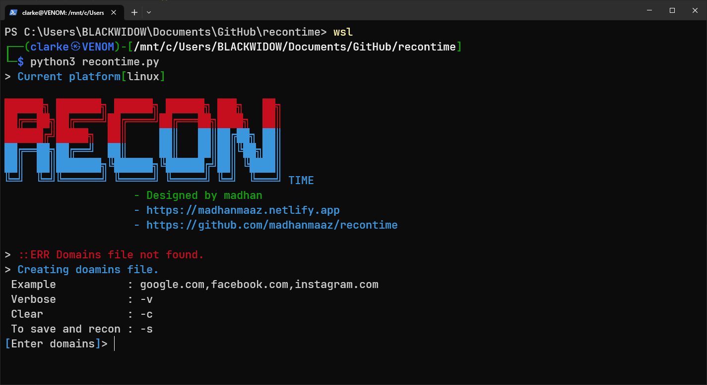
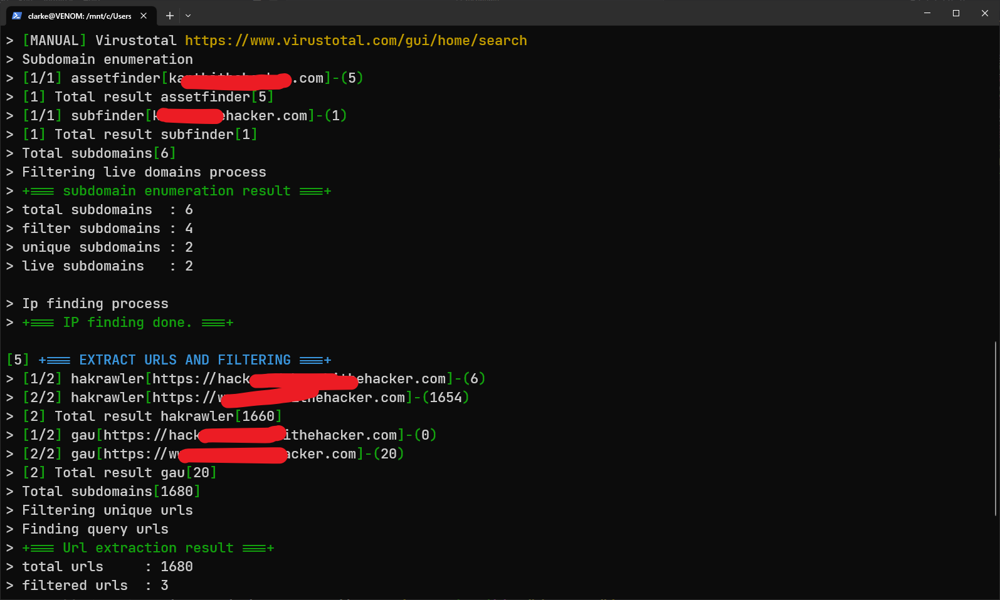

# RECONTIME

- RECONTIME FOR BUG HUNTING


## Installation & Usage

Install RECONTIME with GIT

```bash
git clone https://github.com/madhanmaaz/recontime
```
```bash
cd recontime
```
- install dependencies
```bash
./install.sh
```
- run
```bash
recontime domains.txt
```

## Screenshots



